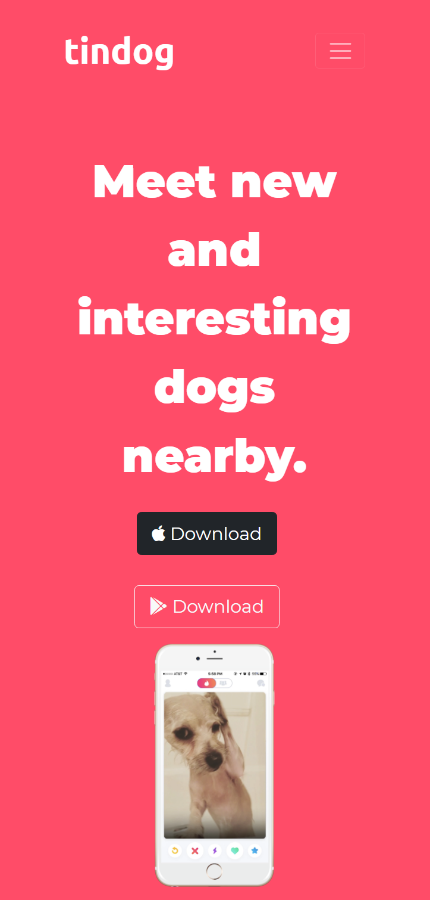

# Tindog

This is Tindog. A social network to find dogs nearby to sniff and play.

## Contents

- [Overview](#overview)
    - [The project](#the-project)
    - [Responsive design](#responsive-design)
    - [Links](#links)
- [My process](#my-process)
    - [Built with](#built-with)
    - [What I learned](#what-i-learned)
    - [Useful resources](#useful-resources)
    - [Author](#author)

## Overview

### The project

This project was built in the Angela's course - Web Development Full Course - on Udemy using the latest version of bootstrap.

### Responsive design

### Links

- Link do projeto online: [Tindog]()

## My process

### Built with

- Semantic HTML5
- Bootstrap CSS Framework
- Flexbox
- Responsive design
- Font Awesome

### What I learned

Tindog was the first project that I used the bootstrap css framework to build a website. Using it facilitates the development in 100%.

I've comprehended how to use several components like buttons, cards and carousel.

Furthermore, I've comprehended how to built the website maintaining the responsivity in mind.

### Useful resources

- Bootstrap Documentation: [See more here](https://getbootstrap.com/docs/5.1/getting-started/introduction/)
- Font Awesome: [See more here](https://fontawesome.com/)

## Author

- Twitter: [Angela Yu](https://twitter.com/yu_angela)